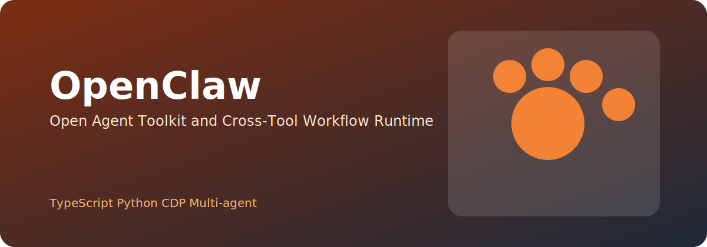

---
tags:
  - 项目
  - 开源
  - Agent
---

# OpenClaw

> 开源 AI 工具集 — 多 Agent 编排 + 可复用工作流模块

{ .project-hero }

## 要解决的问题

现有 AI 编程工具（Claude Code、Cursor 等）各自为政，工作流、Skills、浏览器自动化等能力无法跨工具复用。需要一个统一的开源框架来编排多 Agent 工作流。

## 做了什么

- 设计了跨工具兼容的 Skill 规范（支持 Claude Code / Codex / OpenClaw）
- 实现了浏览器自动化模块（Chrome CDP 双实例架构）
- 构建了多 Agent 编排引擎，支持工作流组合和复用
- 发布了[新手到高阶全攻略](../blog/openclaw-advanced/)

## 技术栈

  TypeScript
  Python
  Chrome CDP
  Puppeteer
  Multi-agent
  JSON Schema
  npm
  pip

## 当前进度

| 模块 | 状态 |
|------|------|
| Skill 规范 | 🟢 v2.0 |
| Chrome CDP 模块 | 🟢 可用 |
| Agent 编排引擎 | 🟡 开发中 |
| CLI 工具 | 🟡 开发中 |
| 文档 | 🟢 基本完善 |

## Repo

- 开发阶段，部分模块已开源

## 下一步

- [ ] 发布 Skill marketplace 原型
- [ ] 支持更多 AI 工具的 Skill 格式适配
- [ ] 完善 Agent 编排 DSL
- [ ] Windows / Linux 平台适配
